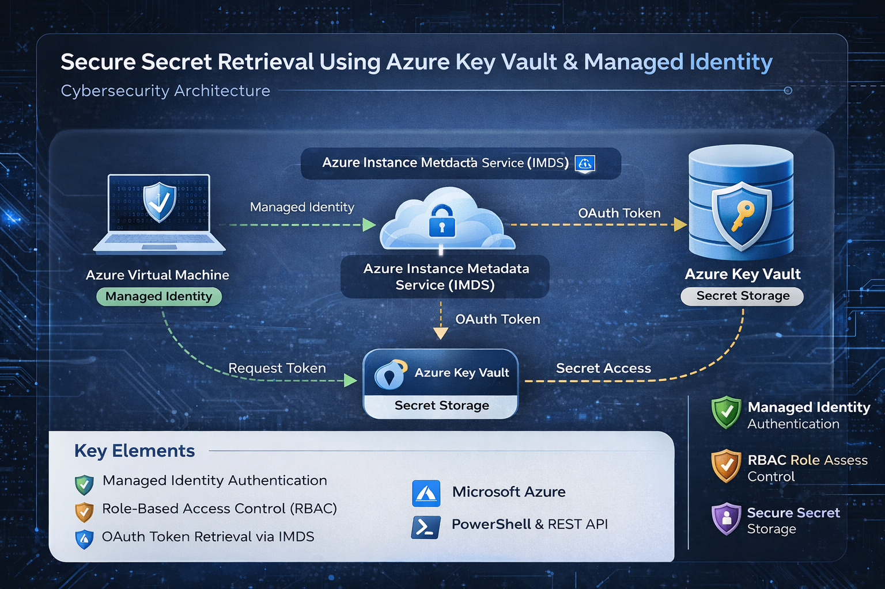
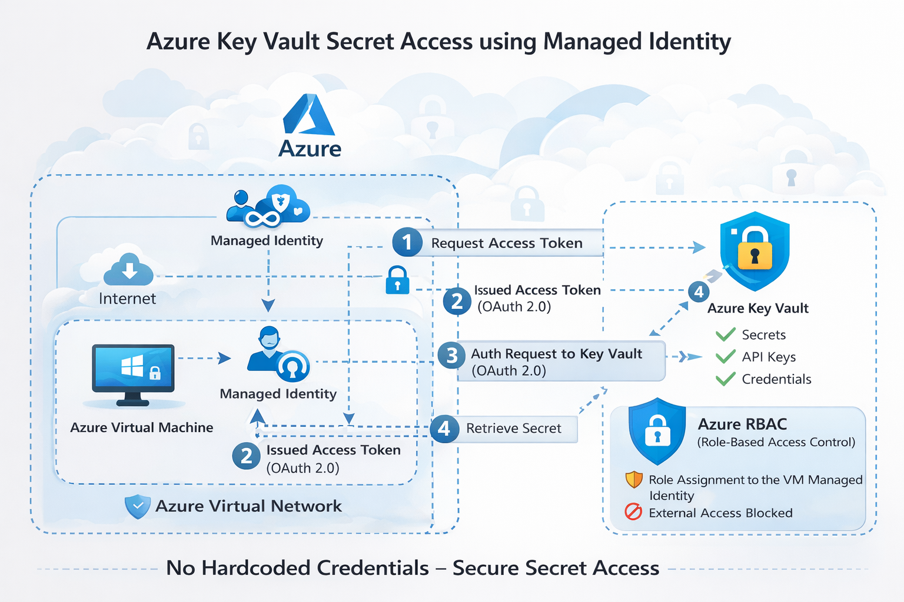
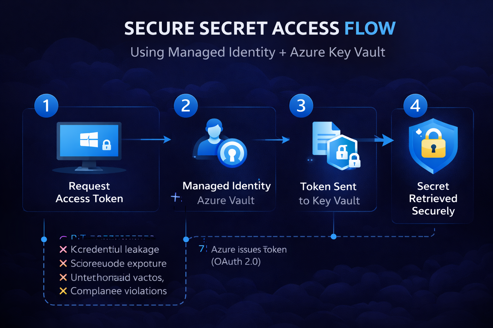
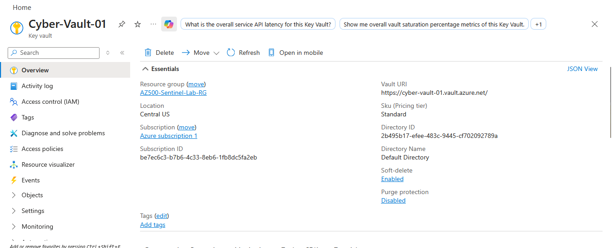
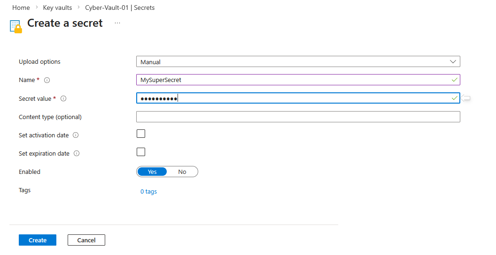
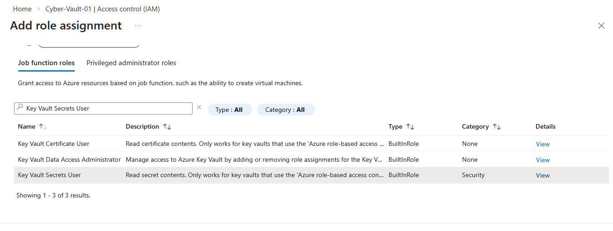
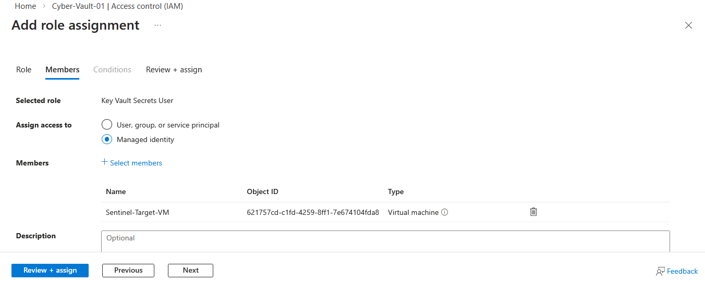
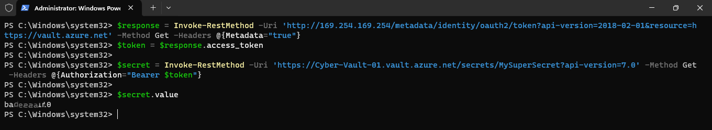
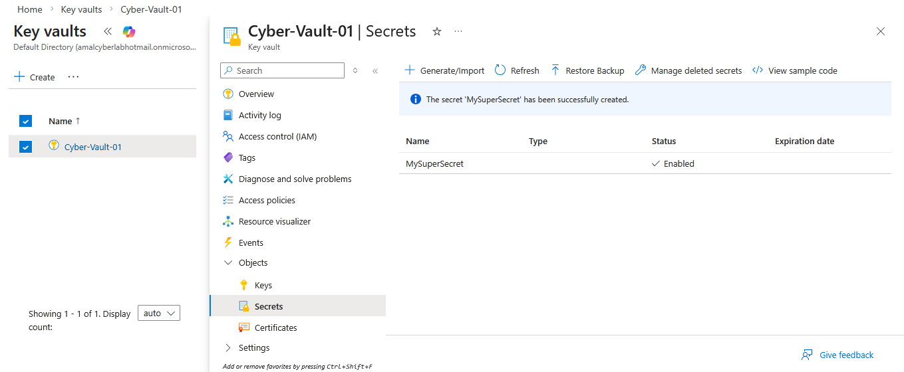
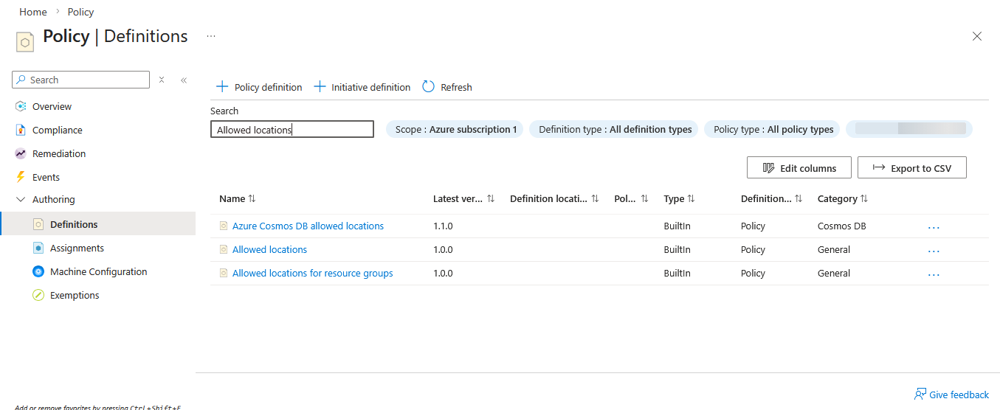

<!-- ================= HERO BANNER ================= -->

<p align="center">

</p>

<h1 align="center">🔐 Azure Key Vault Managed Identity Security Lab</h1>

<p align="center">
A hands-on <b>Cloud Security Lab</b> demonstrating how to securely retrieve secrets using <b>Azure Key Vault</b>, <b>Managed Identity</b>, and <b>Azure RBAC</b> in Microsoft Azure.
</p>

<p align="center">


</p>

---

## 🧩 Key Vault Security Architecture

<p align="center">

</p>

---

# 📌 Overview

This lab demonstrates how cloud applications can securely access secrets without storing credentials in code.

The project shows how to build a **secure secret management architecture using Azure Key Vault and Managed Identity in Microsoft Azure**.

The lab simulates a **real-world cloud security architecture** where a virtual machine securely retrieves secrets from Azure Key Vault using identity-based authentication.

The lab includes:

- Creating an **Azure Key Vault**
- Storing secrets securely
- Deploying a **Virtual Machine**
- Enabling **Managed Identity**
- Assigning **Azure RBAC roles**
- Retrieving secrets using **PowerShell and REST API**
- Implementing **Azure Policy governance**

---

# 🏗️ Lab Architecture

This project demonstrates a **secure identity-based authentication architecture in Microsoft Azure**.

A **Virtual Machine with Managed Identity** authenticates to **Azure Key Vault** using Azure Active Directory tokens instead of passwords.

This architecture eliminates **hardcoded credentials** and improves overall security.

---

## 🔗 Secure Secret Access Flow

<p align="center">

</p>

---

# ⚙️ Lab Deployment Steps

---

# 1️⃣ Create Azure Key Vault



An **Azure Key Vault** is created to securely store application secrets.

Configuration:

Vault Name: `Cyber-Vault-01`  
Region: `Central US`  
Resource Group: `AZ500-KeyVault-Lab`

---

# 2️⃣ Store Secret in Key Vault



A secret is created in Azure Key Vault.

Example secret name:

`MySuperSecret`

---

# 3️⃣ Assign RBAC Role



The **Key Vault Secrets User** role is assigned to the virtual machine.

This allows the VM to securely retrieve secrets from Azure Key Vault.

---

# 4️⃣ Enable Managed Identity



Managed Identity is enabled for the virtual machine.

Managed Identity allows Azure services to authenticate securely without storing credentials.

---

# 5️⃣ Retrieve Secret using PowerShell

```powershell
$response = Invoke-RestMethod `
-Uri 'http://169.254.169.254/metadata/identity/oauth2/token?api-version=2018-02-01&resource=https://vault.azure.net' `
-Method GET `
-Headers @{Metadata="true"}

$token = $response.access_token

$secret = Invoke-RestMethod `
-Uri 'https://Cyber-Vault-01.vault.azure.net/secrets/MySuperSecret?api-version=7.0' `
-Headers @{Authorization="Bearer $token"}

$secret.value
```

---

# 📊 Secret Retrieval Result



---

# 🔐 Secret Stored in Key Vault



---

# 🛡 Azure Policy Governance



Azure Policy can enforce security rules such as:

- Restricting Key Vault network access
- Enforcing encryption standards
- Auditing secret usage

---

# ⚠ Threat Model

| Threat | Risk | Mitigation |
|---|---|---|
| Hardcoded credentials | Credential leakage | Managed Identity |
| Unauthorized access | Data exposure | Azure RBAC |
| Secret exposure | Sensitive data theft | Azure Key Vault |
| Misconfiguration | Security risk | Azure Policy |

---

# 🎯 Security Capabilities Demonstrated

✔ Secure Secret Storage  
✔ Identity-Based Authentication  
✔ RBAC Access Control  
✔ Secure API Authentication  
✔ Cloud Governance with Azure Policy

---

# 🧠 Technologies Used

- Microsoft Azure
- Azure Key Vault
- Managed Identity
- Azure RBAC
- PowerShell
- Azure Policy

---

# 📁 Repository Structure

```
Azure-KeyVault-ManagedIdentity-Lab
│
├── README.md
│
├── images
│   ├── create-key-vault.png
│   ├── create-secret.png
│   ├── add-the-role.png
│   ├── add-the-vm-vault.png
│   ├── result.png
│   ├── secret.png
│   └── policy-definitions.png
│
└── architecture
    └── architecture.png
```

---

# 👨‍💻 Author

**Amal Udayanga Basnayake**

Cybersecurity Enthusiast  

Cloud Security • Azure Security • Identity Security • Key Vault

GitHub  
https://github.com/AmalUBasnayake  

LinkedIn  
https://www.linkedin.com/in/amal-udayanga-basnayake  

Medium  
https://medium.com/@amalubasnayake  

---

⭐ If you found this project useful, consider giving the repository a **star**.
